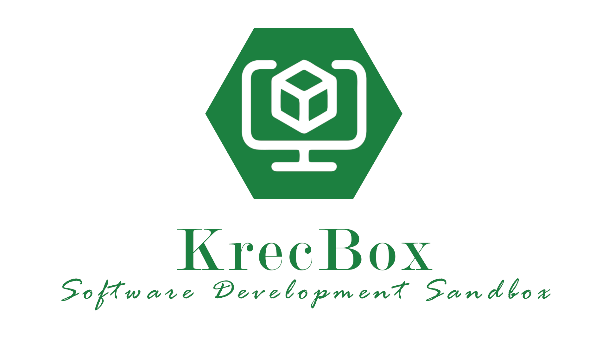

# 

The Krec-Box is a virtual Ubuntu 24.04 machine, as a reusable development environment. How to create an own
vagrant base box from scratch read [here](docs/CreateVagrantBaseBox.md).

## Content

* [Requirements](#requirements)
    * [Software](#software)
* [Initial Steps](#initial-steps)
    * [Clone the repository to host](#clone-the-repository-to-host)
* [Start Krec-Box](#start-krec-box)
* [Development at the beating heart](#development-at-the-beating-heart)
* [Usage of Krec-Box](#usage-of-krec-box)
    * [Re-provisioning](#re-provisioning)
    * [Own Playbook](#own-playbook)
    * [Usage Thought](#usage-thought)
    * [List of Roles](#list-of-roles)

## Requirements

### Software

You need the following software on your host system

* [VirtualBox](https://www.virtualbox.org/wiki/Downloads)
* [Vagrant](https://www.vagrantup.com/downloads.html)
* [Git](https://github.com/git-guides/install-git)

## Initial Steps

The following steps only need to be performed during the initial setup and after that this section can be
skipped.

### Clone the repository to host

In order to start the Krec-Box, the code resources from the Git repository are required. How a repository
can be cloned is described
[here](https://docs.github.com/en/repositories/creating-and-managing-repositories/cloning-a-repository).

## Start Krec-Box

A PowerShell script with the name startKrecBox.ps1 exists in the repository. When starting the Krec-Box for the first
time this script needs to be started as administrator. Vagrant requires admin rights on a Windows host in order to load
the base box from the Vagrant cloud and store it locally. Once the Krec-Box has been created, simple user rights are
sufficient to start the box by double-clicking on startKrecBox.ps1.

The progress of the provisioning can be tracked in the Command window on the host system and looks
something like the following output.

```shell script
...
    devbox: TASK [apt-install-items : install packages with apt] ***************************
    devbox: ok: [localhost] => {"cache_update_time": 1631879899, "cache_updated": true, "changed": false}
    devbox:
    devbox: TASK [docker : Ensure old versions of Docker are not installed.] ***************
    devbox: ok: [localhost] => {"changed": false}
    devbox:
    devbox: TASK [docker : Ensure dependencies are installed.] *****************************
    devbox: ok: [localhost] => {"cache_update_time": 1631879899, "cache_updated": false, "changed": false}
    devbox:
    devbox: TASK [docker : Add Docker apt key.] ********************************************
    devbox: ok: [localhost] => {"changed": false}
    devbox:
    devbox: TASK [docker : Add Docker repository.] *****************************************
    devbox: ok: [localhost] => {"changed": false, "repo": "deb [arch=amd64] https://download.docker.com/linux/ubuntu focal stable", "state": "present"}
    devbox:
    devbox: TASK [docker : Install Docker.] ************************************************
    devbox: ok: [localhost] => {"cache_update_time": 1631879899, "cache_updated": false, "changed": false}
...
    devbox:
    devbox: PLAY RECAP *********************************************************************
    devbox: localhost                  : ok=26   changed=0    unreachable=0    failed=0    skipped=19   rescued=0    ignored=0
``` 

## Development at the beating heart

Ansible roles can also be developed within the DevBox. To test single roles you
can temporarily create your own playbook or you can work with tags.

If you assign a tag to a role.

```yaml
- { role: rollen_name, tags: rollen_tag }
```

Then this role can also be executed separately.

```shell script
- ansible-playbook ansible/setup-playbook_name.yml --tags rollen_tag
```

## Usage of Krec-Box

The password for the DevBox is **vagrant**, as is typical for most Vagrant boxes.

### Re-provisioning

In order to be able to apply new functions and bug fixes in the configuration to your own Krec-Box, it should be
re-provisioned regularly (preferably at every start). This is done with the PowerShell script startKrecBox.ps1. The
virtual machine created by Vagrant can be started as usual via the VirtualBox menu. However, it is recommended to start
the Krec-Box via the start script.

### Own Playbook

The file setup-krec-box.yml is the default playbook for the Krec-Box. If the configuration of the Ansible roles to be
used is not suitable for your own needs, another playbook can be placed next to it. The name of the playbook needs to be
replaced in the Vagrantfile. In this way, the Krec box is provisioned with other software.

### Usage Thought

The Krec-Box is designed as a disposable solution. Every user should be able to simply throw away the virtual machine at
any time and create a replacement. The **urgent recommendation** is therefore the following:

When you manually install new programs into the Krec-Box ask yourself two questions:

* Do others on my team need this feature?
* How much effort will it take to reinstall if the Krec-Box has to be thrown away?

Often the answer will be that it is well worth automating the installation of new programs. (actually always :wink:). In
that case, be encouraged to create new roles in the `ansible/roles` folder. These roles can then be included in the
playbook.

Documentation on Ansible can be found [here](https://docs.ansible.com/ansible/latest/user_guide/index.html).

### List of Roles

* [ansible-facts-packages](ansible/roles/ansible-facts-packages/README.md)
* [apt-install-items](ansible/roles/apt-install-items/README.md)
* [autologin](ansible/roles/autologin/README.md)
* [chrome](ansible/roles/chrome/README.md)
* [cleanup-apps](ansible/roles/cleanup-apps/README.md)
* [disable-lock-screen](ansible/roles/disable-lock-screen/README.md)
* [intellij-community](ansible/roles/intellij-community/README.md)
* [keyboard-layout-de](ansible/roles/keyboard-layout-de/README.md)
* [locale-de](ansible/roles/locale-de/README.md)
* [resize-desktop](ansible/roles/resize-desktop/README.md)
* [timezone-berlin](ansible/roles/timezone-berlin/README.md)
